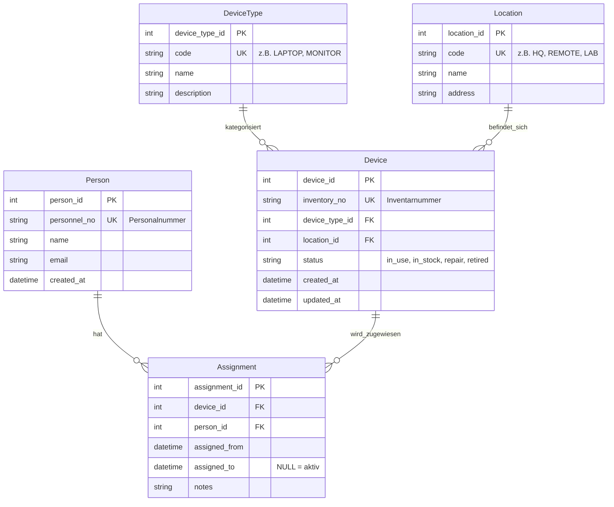

# Inventar-Domänenmodell

## Entity-Relationship-Diagramm (Mermaid)

## Geschäftsregeln

### R1: Eindeutigkeitsregeln (UK - Unique Keys)
- `Person.personnel_no` ist eindeutig (z.B. "P001", "P002")
- `DeviceType.code` ist eindeutig (z.B. "LAPTOP", "MONITOR")
- `Location.code` ist eindeutig (z.B. "HQ", "REMOTE")
- `Device.inventory_no` ist eindeutig (z.B. "INV-2025-001")

### R2: Aktive Zuweisung
- Zu einem Zeitpunkt darf ein Device höchstens **eine aktive Zuweisung** haben
- Aktive Zuweisung = `Assignment.assigned_to IS NULL`
- Implementierung: Unique-Constraint oder Check in der Anwendungslogik

### R3: Historisierung
- Vergangene Zuweisungen werden **nicht gelöscht**, sondern mit `assigned_to` 
  abgeschlossen
- Dadurch: vollständige Historie pro Device

### R4: Device-Status
- Erlaubte Werte für `Device.status`:
  - `in_use` - in Benutzung (hat aktive Zuweisung)
  - `in_stock` - auf Lager (keine aktive Zuweisung)
  - `repair` - in Reparatur
  - `retired` - ausgemustert

### R5: Zeitliche Konsistenz
- `assigned_from` < `assigned_to` (falls assigned_to nicht NULL)
- Keine überlappenden Assignments für dasselbe Device

## Normalisierung

- **1NF**: Alle Attribute sind atomar (keine Listen oder zusammengesetzten Werte)
- **2NF/3NF**: Stammdaten (Person, DeviceType, Location) getrennt von 
  Bewegungsdaten (Assignment)
- Vermeidung von Redundanz durch Fremdschlüssel-Beziehungen

